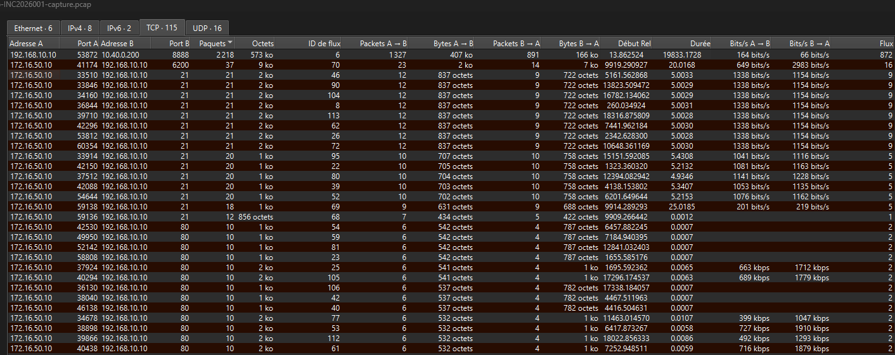
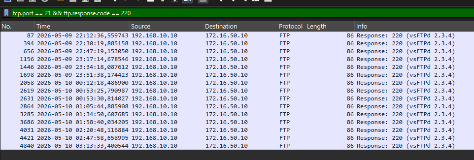

# Incident Report — NexaCorp
**Reference:** INC-2026-001  
**Prepared by:** BeCode Corp SOC  
**Date:** 2026-05-13  
**Classification:** Confidential

---

## PHASE 1 — FORENSIC ANALYSIS

### 1. Executive Summary

On the evening of May 9, 2026, NexaCorp's internal server (`192.168.10.10`) was compromised by an external attacker (`172.16.50.10`). The attacker began with a port scan to identify open services, then connected to the server's FTP service — running vsftpd 2.3.4, a version with a publicly known backdoor vulnerability (CVE-2011-2523, disclosed in 2011). By sending a specially crafted username containing the characters `:)`, the attacker triggered the backdoor, which automatically opened an interactive root shell on port 6200. The attacker then used this shell to explore the system with full administrative privileges, enumerating users, files, and network configuration. The SIEM (Wazuh) generated no alerts throughout the incident. NexaCorp's FTP server must be taken offline immediately. The vsftpd service must be replaced. Detection rules and network controls must be deployed before the server is returned to production.

---

### 2. Attack Timeline

| Timestamp (UTC) | Event | Source |
|---|---|---|
| 2026-05-09 20:08:16 | Port scan begins — attacker probes ports 80, 22, 443, 8080, 8443 | PCAP |
| 2026-05-09 20:12:36 | Attacker probes port 21 (FTP) | PCAP |
| 2026-05-09 22:08:16 | FTP session established — exploit trigger sent (`USER <user>:)`) | PCAP |
| 2026-05-09 22:12:36 | Server banner captured: `220 (vsFTPd 2.3.4)` | PCAP |
| 2026-05-10 00:53:35 | TCP connection to port 6200 — backdoor shell active | PCAP |
| 2026-05-10 00:53:35+ | Attacker executes commands as root (see Section 4, Q3–Q4) | PCAP / TCP Stream |

---

### 3. Technical Findings

#### Q1 — What reconnaissance activity occurred?

The attacker performed a TCP port scan from `172.16.50.10` against `192.168.10.10`, probing ports 80, 22, 443, 8080, 8443, and 21. Each connection produced a SYN → RST or SYN → ACK → RST pattern — short-lived connections with no application data — characteristic of a port scan. In `Statistics → Conversations → TCP` (Wireshark), the attacker IP shows 114 connection attempts, with no significant data volume. This is distinct from normal traffic, which shows established sessions with meaningful byte counts.



#### Q2 — What service was exploited?

The FTP service running on port 21 was exploited. The server banner, captured in the FTP TCP stream, identified the software and version:

```
220 (vsFTPd 2.3.4)
```

vsftpd 2.3.4 contains a deliberately planted backdoor (**CVE-2011-2523**). When a username containing the string `:)` is sent to the FTP server, the backdoor is triggered and a root shell is opened on port **6200/tcp**. This vulnerability has been publicly known since 2011 and has no legitimate use case — any server still running this version represents an unacceptable risk.



#### Q3 — What happened after the exploit succeeded?

After the `:)` trigger was sent over FTP (port 21), the server opened port 6200 and accepted an incoming TCP connection from the attacker. The TCP stream on port 6200 shows a pattern of short requests followed by longer responses — consistent with interactive shell command execution. The attacker connected and the backdoor confirmed shell access.

**Evidence from PCAP — port 6200 TCP stream:**

The stream shows small outbound packets from the attacker (3–27 bytes per command) followed by proportionally larger server responses (24–2356 bytes), confirming a live interactive shell session.


#### Q4 — What did the attacker do once inside?

The attacker executed the following commands via the backdoor shell:

```
id       → uid=0(root) gid=0(root)
whoami   → root
uname -a → Linux metasploitable 2.6.24-16-server
hostname → metasploitable
cat /etc/passwd | head -10
ls /home → ftp, msfadmin, service, user
ifconfig → inet addr: 192.168.10.10
netstat -an | grep LISTEN  → confirms port 6200 LISTEN
```

The attacker confirmed full root access, identified the OS and hostname, enumerated local user accounts, and mapped the server's network configuration. This level of access would allow data exfiltration, persistence installation, or lateral movement. See previous screenshot.


#### Q5 — What did Wazuh show? Did the SIEM catch anything?

The Wazuh SIEM generated **no alerts** during the incident window. The `wazuh-alerts.json` file from the evidence package returned a 404 error, indicating that no alert data was exported for this host during the incident period.


**Detection gap:** The SIEM failed to detect the attack for the following reasons:

- No rule existed for CVE-2011-2523 or the vsftpd 2.3.4 backdoor trigger pattern
- Successful FTP authentication events are not flagged by default
- The backdoor shell on port 6200 generates no recognisable protocol signature without a specific rule
- The Wazuh agent may not have been active or properly configured on the target host during the incident window

---

### 4. Indicators of Compromise (IOCs)

| Type | Value | Context |
|---|---|---|
| IP — Attacker | `172.16.50.10` | Port scanner and exploit source |
| IP — Target | `192.168.10.10` | Compromised FTP server |
| Port — Exploited | `21/tcp` | FTP service (vsftpd 2.3.4) |
| Port — Backdoor | `6200/tcp` | Root shell opened by CVE-2011-2523 |
| CVE | CVE-2011-2523 | vsftpd 2.3.4 backdoor |
| Trigger pattern | `USER <any>:)` | FTP username containing `:)` activates backdoor |
| Service banner | `220 (vsFTPd 2.3.4)` | Identifies vulnerable software version |
| Hostname | `metasploitable` | Compromised host identifier |

> **Note on port 8888 traffic:** During the PCAP analysis, a persistent session was observed from `192.168.10.10` to `10.40.0.200:8888` (approx. 5.5 hours, 572 KB). This address corresponds to the lab management server (Wazuh/evidence collection infrastructure) and represents legitimate monitoring traffic. It was investigated and excluded from the compromise analysis.

---

### 5. Detection Gap

The following controls, if in place, would have detected or prevented the attack:

| Control | What it would have caught |
|---|---|
| Suricata rule on FTP `:)` pattern | Exploit trigger at the moment of execution |
| Suricata rule on port 6200 | Backdoor connection immediately after exploit |
| Vulnerability scanner (e.g. OpenVAS) | vsftpd 2.3.4 flagged before exploitation |
| Firewall rule blocking outbound 6200 | Backdoor connection prevented at network level |
| SIEM rule for unusual FTP usernames | Alert on malformed username pattern |

---

## PHASE 2 — DETECTION ENGINEERING

### 1. Suricata Rules

The following rules were written to detect the attack identified in Phase 1. All rules are stored at `/etc/suricata/rules/learner/lab.rules`.

```suricata
# Rule 9000001 — Detect vsftpd 2.3.4 vulnerable banner
# Rationale: The server identifies itself in the first FTP response.
# Detecting this banner flags the presence of a vulnerable service,
# even before any exploit attempt. Direction: server → client.
alert tcp $HOME_NET 21 -> any any (
  msg:"VULNERABLE SERVICE vsftpd 2.3.4 banner detected";
  flow:established,to_client;
  content:"220 (vsFTPd 2.3.4)";
  sid:9000001; rev:1;
)

# Rule 9000002 — Detect CVE-2011-2523 exploit trigger
# Rationale: The backdoor activates when a username containing ":)"
# is sent. The rule matches the FTP USER command followed by the
# trigger string. flow:to_server limits to client→server traffic,
# reducing false positives. Double content ensures :) appears in
# the username field specifically.
alert tcp any any -> $HOME_NET 21 (
  msg:"EXPLOIT FTP vsftpd 2.3.4 - Backdoor trigger detected CVE-2011-2523";
  flow:to_server,established;
  content:"USER ";
  content:":)";
  sid:9000002; rev:1;
)

# Rule 9000003 — Detect connection to backdoor port 6200
# Rationale: When the exploit succeeds, the server opens a root shell
# on port 6200. No legitimate service uses this port on this server.
# Any TCP connection to this port is a true positive.
alert tcp any any -> $HOME_NET 6200 (
  msg:"BACKDOOR vsftpd 2.3.4 - Connection to port 6200 detected";
  sid:9000003; rev:1;
)
```

---

### 2. Test Evidence

Rules were validated by running Suricata in offline mode against the evidence PCAP (Windows environment — tcpreplay was not available; offline mode produces equivalent results for rule validation):

```
.\suricata.exe -c suricata.yaml -S myrules.rules -r attack.pcap -l C:\suricata_output
```

**Syntax validation:**
```
i: suricata: Configuration provided was successfully loaded. Exiting.
```

**Alerts generated (fast.log output):**
```
05/09/2026-22:08:16.523727  [**] [1:9000002:1] EXPLOIT FTP vsftpd 2.3.4 - Backdoor trigger detected CVE-2011-2523 [**] {TCP} 172.16.50.10:59138 -> 192.168.10.10:21

05/10/2026-00:53:35.814654  [**] [1:9000003:1] BACKDOOR vsftpd 2.3.4 - Connection to port 6200 detected [**] {TCP} 172.16.50.10:41174 -> 192.168.10.10:6200
```

Both rules fired at the correct timestamps corresponding to the exploit trigger and backdoor connection identified in Phase 1.

c:\Users\pc\Desktop\Blue Team\Incident report\screenshot6.png

---

### 3. False Positive Analysis

After replay against the full PCAP:

| Rule | SID | Alerts fired | False positives |
|---|---|---|---|
| Banner detection | 9000001 | 1 | None |
| Exploit trigger | 9000002 | 1 | None |
| Backdoor connection | 9000003 | 1 | None |

No false positives were observed. The `:)` pattern does not appear in any legitimate FTP username in the PCAP. Port 6200 carries no legitimate traffic on this server. If the environment had other FTP servers, Rule 9000001 could trigger on any vsftpd 2.3.4 instance — which is intentional, as the banner itself is the risk indicator.

c:\Users\pc\Desktop\Blue Team\Incident report\screenshot7.png

---

### 4. Rule Limitations

| Limitation | Affected rules | Evasion scenario |
|---|---|---|
| Port 6200 is hardcoded | 9000003 | Attacker recompiles backdoor to use a different port (e.g. 8888) |
| Trigger `:)` is a fixed string | 9000002 | Variations such as `: )` or `;-)` would not match |
| Cleartext traffic only | All rules | FTPS (encrypted FTP) hides payload — all content-based rules fail |
| Banner spoofing | 9000001 | Attacker modifies the vsftpd banner string — rule does not fire |
| Signature-based only | All rules | A zero-day or modified exploit variant would not be detected |

---

### 5. Recommendations

| Priority | Recommendation | Rationale |
|---|---|---|
| 🔴 Immediate | **Patch or remove vsftpd 2.3.4** — upgrade to 2.3.5+ or replace with SFTP | CVE-2011-2523 has been fixed since 2011. No justification for running this version. |
| 🔴 Immediate | **Block port 6200 at the firewall** — inbound and outbound | Prevents backdoor communication even if the exploit is triggered |
| 🟡 Short-term | **Replace FTP with SFTP** | FTP transmits credentials and data in cleartext. SFTP provides encryption by default. |
| 🟡 Short-term | **Enable Suricata rules** from Phase 2 in IPS mode | Moves from detection to active blocking of known attack patterns |
| 🟡 Short-term | **Deploy a vulnerability scanner** (e.g. OpenVAS) | Would have identified vsftpd 2.3.4 as critical-risk before exploitation |
| 🟢 Medium-term | **Isolate legacy services in a DMZ** | Limits lateral movement if a legacy service is compromised |
| 🟢 Medium-term | **Retain PCAP logs for 30+ days** | Enables post-incident analysis; current capture was insufficient in scope |
| 🟢 Medium-term | **Establish a patch management policy** | Ensures known CVEs are remediated within defined SLAs |

---

*BeCode Corp | NexaCorp Engagement | INC-2026-001*  
*Classification: Confidential — Not for distribution*
