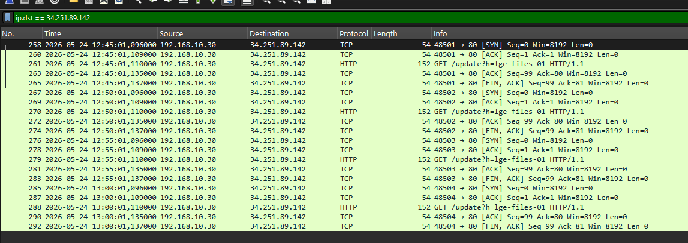

# INC-2026-003 — Lateral Movement & Persistent C2 Compromise

> Incident response investigation on a critical lateral movement to a third NexaCorp server — direct continuation of INC-2026-001 and INC-2026-002 (same threat actor).

| Field | Value |
|-------|-------|
| **Incident ID** | INC-2026-003 |
| **Classification** | Critical |
| **Target** | `lge-files-01` — NexaCorp Liège file server (192.168.10.30) |
| **Pivot source** | `bru-app-01` — Brussels application server (192.168.10.20) |
| **Analyst** | André Penas |
| **Date** | 2026-05-24 |

---

## What happened

Re-using the `it_support` backdoor planted in INC-2026-002, the attacker re-entered `bru-app-01`, harvested the `svc_api` SSH private key, and within 90 seconds pivoted to the Liège file server `lge-files-01` as `svc_backup`. The corresponding public key had already been pre-positioned there during INC-2026-001 — the three incidents form a single continuous operation.

Once on the file server, the attacker escalated to root via a misconfigured `sudo python3 NOPASSWD`, created a hidden admin account (`sysupdate`), installed a cron-based C2 beacon, and read database credentials. Both persistence mechanisms were still active at the time of reporting.

**Attack chain — 8 steps:**

| # | Technique | ATT&CK |
|---|-----------|--------|
| 1 | Re-entry via `it_support` backdoor (Tor exit node) | T1078 |
| 2 | Privilege escalation to root on pivot host (`sudo /bin/bash`) | T1548.003 |
| 3 | SSH private key harvest (`svc_api` `id_rsa`) | T1552.004 |
| 4 | SSH pivot to `lge-files-01` as `svc_backup` (stolen key) | T1021.004 |
| 5 | Root via `sudo python3 NOPASSWD` (SUID `find` available as fallback) | T1548.003 |
| 6 | Backdoor account `sysupdate` created (sudo group) | T1136.001 |
| 7 | Cron C2 beacon to `34.251.89.142` every 5 min | T1053.003 / T1071.001 |
| 8 | Credential & data reconnaissance (`db-credentials.env`) | T1552 / T1083 |

---

## Investigation

- Full attack chain reconstructed across **two hosts** from auth.log, sudo/sshd journals, audit.log and syslog
- **Network evidence:** C2 beacon traffic confirmed in the packet capture — plaintext HTTP GET to `34.251.89.142` every 5 minutes, output redirected to `/dev/null` to suppress logging (Wireshark screenshot below)
- 10-technique MITRE ATT&CK mapping and full IOC table
- 9 prioritised immediate remediation actions + medium-term hardening (SSH CA, egress filtering, least-privilege service accounts, access baselining)

→ [Full incident report](INC-2026-003_Incident_Report.md)

---

## Three-incident kill chain

| Incident | Server | Method | Outcome |
|----------|--------|--------|---------|
| INC-2026-001 | lge-services-01 | FTP backdoor | Initial foothold; `svc_api` public key pre-positioned |
| INC-2026-002 | bru-app-01 | SUID `/usr/bin/find` | Root; `svc_api` private key harvested |
| INC-2026-003 | lge-files-01 | Stolen SSH key pivot; `sudo python3 NOPASSWD` | Root; `sysupdate` backdoor; active C2; credential access |

Same actor confirmed by the shared external IP `185.220.101.62`, consistent backdoor naming (`it_support`, `sysupdate`), and direct reuse of artefacts planted in earlier incidents.

---

## Skills demonstrated

- Multi-host attack chain reconstruction and cross-incident correlation
- SSH key-theft and lateral movement analysis
- Sudo / NOPASSWD privilege escalation mechanics
- Cron-based C2 persistence identification
- Network forensics — C2 beacon analysis in Wireshark (PCAP)
- MITRE ATT&CK mapping (10 techniques)
- Incident-driven remediation and hardening recommendations
